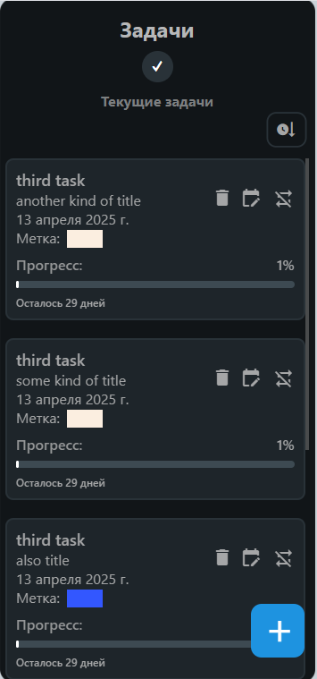
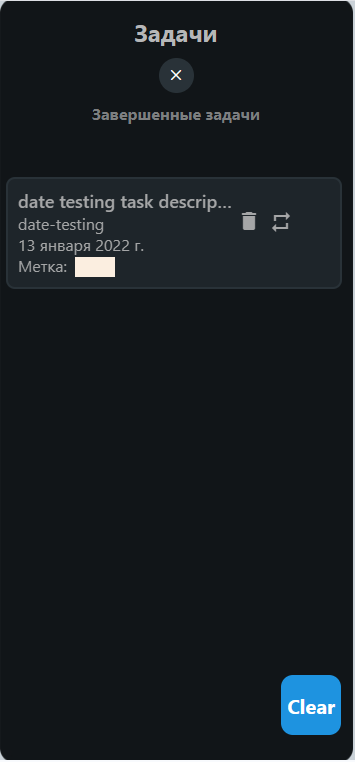
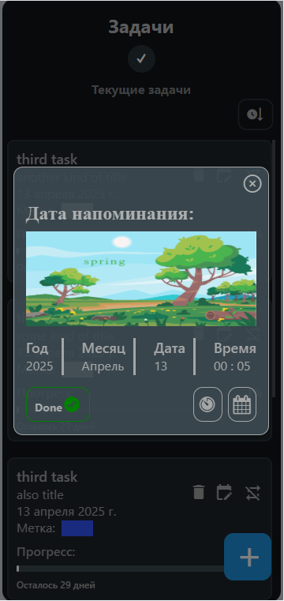
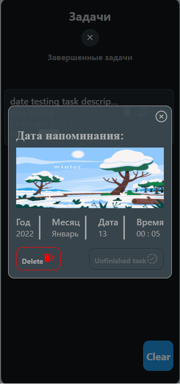
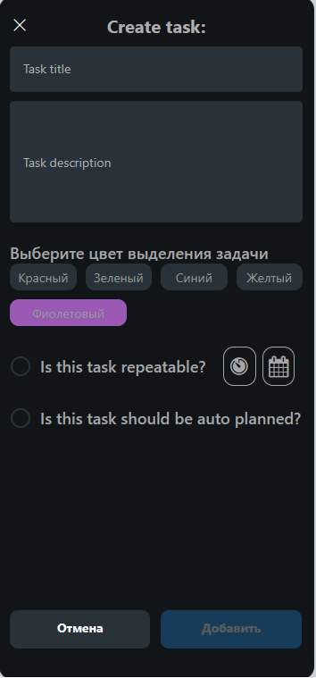
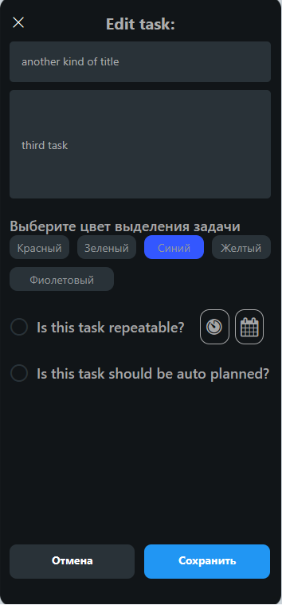
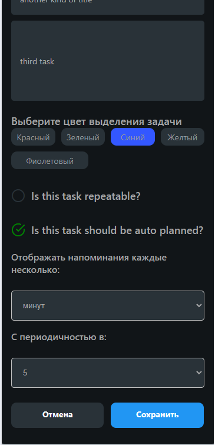
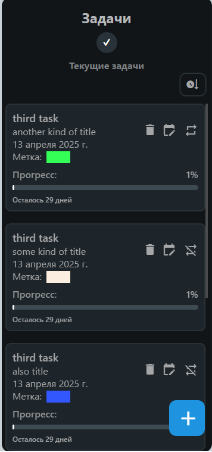
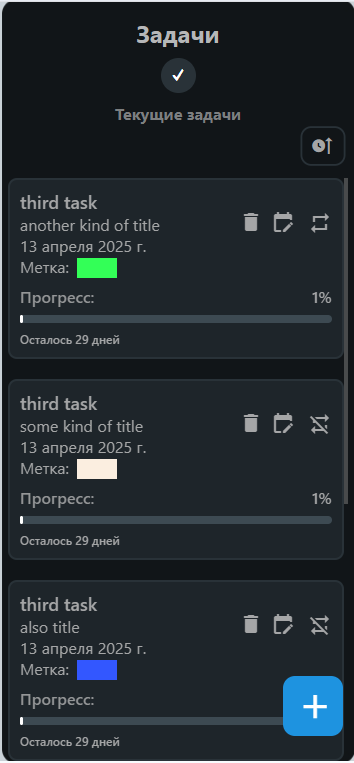
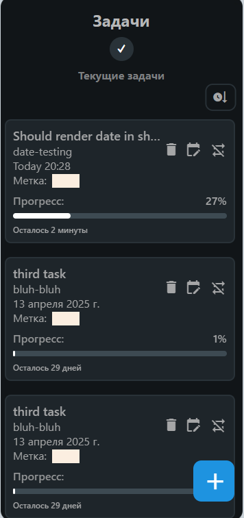

# Знакомство с React-Native

Основная задача приложения - гибкое создание напоминаний.

Виды напоминаний - самопланирующиеся через интервалы, повторяющиеся и одноразовые.
Повторяющиеся самостоятельно перепланируются после события напоминания.
Повторяющиеся переход в список задач отработанных, пользователь может восстановить их из этого журнала, чтобы не вбивать задачу по второму разу.
Одноразовые после события напоминания удаляются.

Задачи хранятся в локальном состоянии, при открытии/разворачивании синхронизируются. При полном открытии и закрытии приложения все задачи забираются
из аналога localStorage, обрабатываются, отработанные удаляются, актуальные помещаются в свои списки. Все действия пользователя уже синхронизированы с
localStorage, чтобы сохранять списки актуальных задач.

Большая часть UI компонентов была написана самостоятельно, без сторонних библиотек, на собственных тумаках и шишках.

Это примеры UI:

## Скриншоты приложения

### Основные экраны

#### Список задач

  
   
  <em>Скриншот 1: Список задач.</em>

#### Список выполненных задач

  
   
  <em>Скриншот 2: Список выполненных задач.</em>

### Модальные окна

#### Детали задачи

  
   
  <em>Скриншот 3: Модальное окно при раскрытии деталей задачи.</em>

#### Детали выполненной задачи

  
   
  <em>Скриншот 4: Модальное окно при раскрытии деталей выполненной задачи.</em>

### Создание и редактирование задач

#### Страница создания задачи

  
   
  <em>Скриншот 5: Страница создания задачи.</em>

#### Страница редактирования задачи

  
   
  <em>Скриншот 6: Страница редактирования задачи.</em>

### Настройки

#### Настройки автопланирования задачи

  
   
  <em>Скриншот 7: Настройки автопланирования задачи.</em>

#### Список задач с примененными настройками

  
   
  <em>Скриншот 8: Список задач с различными примененными настройками.</em>

### Сортировка и прогресс

#### Отсортированный список задач

  
   
  <em>Скриншот 9: Список задач отсортированный.</em>

#### Прогресс бар

  
   
  <em>Скриншот 10: Список задач с демонстрацией работы прогресс бара.</em>

### Лоадер

#### Пример лоадера

  
   
  <em>Скриншот 11: Пример лоадера.</em>

